# 🌿 منصة أثر التعليمية | Athar Educational Platform

<div align="center">


### المنصة السحابية الذكية لإدارة ومتابعة المجموعات التعليمية والتربوية بالذكاء الاصطناعي
**An Advanced, AI-Powered, Offline-First Student Tracking & WhatsApp Engagement System**

[](https://athar-final1.web.app)
[](https://athar-final1.web.app/presentation)
[](https://github.com/hassanrashid111/Athar)

<br/>

[](https://athar-final1.web.app)
[](https://athar-final1.web.app)
[](https://ai.google.dev/)
[](https://firebase.google.com/)
[](LICENSE)

</div>

---

## 📖 نبذة عامة (Project Overview)

**منظومة أثر التعليمية** هي منصة ويب متطورة وتطبيق ويب تقدمي (**Progressive Web App - Offline First**) صُممت بأعلى المعايير البرمجية لتنظيم وإدارة ومتابعة طلاب المجموعات والحلقات العلمية والتربوية المكثفة.

تجمع المنصة بين **سرعة الرصد الميداني (0 ثانية)**، وقدرات **نماذج الذكاء الاصطناعي (Google Gemini AI)** في تنظيف البيانات وصياغة الرسائل التفاعلية الدافئة، وخوارزميات **رادار التسرب المبكر**، ومحرر **الشهادات التفاعلي بالسحب والإفلات**، ونظام **العمل الكامل بدون إنترنت مع الحفاظ على التوقيت الفعلي الدقيق بالمللي ثانية لعدالة التقييم**.

---

## 🌟 المزايا الاستثنائية للمنظومة (Key Architectural Features)

```mermaid
graph TD
    A[منظومة أثر التعليمية] --> B[🤖 محرك الذكاء الاصطناعي Gemini]
    A --> C[📴 العمل الكامل بدون إنترنت PWA]
    A --> D[🎯 رادار التسرب والمتابعة المبكرة]
    A --> E[📜 محرر الشهادات التفاعلي]
    A --> F[👥 نظام تسليم واستلام الطلاب]
    A --> G[👑 لوحة التحكم العليا Super Admin]
    A --> H[🧬 خط أنابيب بيانات التعلم الآلي ML Pipeline]
    
    B --> B1[المنظف الذكي للقوائم]
    B --> B2[صياغة رسائل المتابعة الشخصية]
    B --> B3[مراعاة الفئات العمرية والأسلوب التربوي]
    
    C --> C1[حفظ التوقيت الفعلي الدقيق]
    C --> C2[فتح فوري 0ms بدون اتصال]
    C --> C3[طابور المزامنة التلقائية فور عودة الشبكة]
    
    G --> G1[مراقبة استهلاك Gemini والشهادات والأوفلاين]
    G --> G2[التحكم الفوري بحالة النظام Active/Paused]
    G --> G3[إدارة الدورات وتصفير المراحل Epochs]
    G --> G4[إدارة طلبات الانضمام والديمو]
    
    H --> H1[نظام الحذف الذكي والتصنيف ML Labeling]
    H --> H2[استخراج الخصائص Attendance Ratio]
    H --> H3[قاموس أسباب الانسحاب المشترك]
```



---

### 1. 👑 لوحة التحكم العليا الشاملة (Super Admin Helicopter View)
- **الوصول المحمي:** مسار خاص `/super-admin` محمي على مستوى المسار والقواعد للمشرف الأعلى (`hrhalsharif@gmail.com`).
- **المقاييس اللحظية (System Analytics):**
  - عداد كلي لاستدعاءات Gemini مصنف حسب الوظيفة (رسائل المتابعة، المنظف الذكي، الأخطاء).
  - عداد الشهادات المصدّرة وعدد عمليات الأوفلاين المنفذة.
- **قاطع حالة النظام الفوري (Realtime System Status Gate):**
  - التبديل بين `active` و `paused` بنقرة واحدة.
  - إخراج فوري لكافة المشرفين المتصلين عند الإيقاف المؤقت وتحويلهم لشاشة الانتظار الفاخرة.
- **مدير الدورات (Epoch Manager):**
  - تدشين دورات جديدة وتحديد تواريخ البدء والنهاية والأرشفة.
- **إدارة طلبات الانضمام (Demo Requests):**
  - مراجعة طلبات الانضمام الواردة من صفحة الهبوط وقبولها أو رفضها فورياً.

---

### 2. 🧬 نظام الحذف الذكي وخط أنابيب بيانات التعلم الآلي (ML Data Pipeline & Soft Delete)
- **وداعاً للحذف العشوائي:** التمييز الصارم بين:
  - ⚠️ **خطأ في البيانات / نقل:** حذف نهائي معزول لا يلوث بيانات التدريب.
  - 🚶 **تسرب / انسحاب حقيقي:** حذف ناعم ذكي مع تصنيف آلي للبيانات (**ML Data Labeling**).
- **هندسة الخصائص الآلية (Feature Engineering):**
  - حساب نسبة الحضور اللحظية (`attendance_ratio`) تلقائياً بدقة لحظة الانسحاب.
  - تسجيل الطابع الزمني للانسحاب (`withdrawal_timestamp`).
- **قاموس أسباب الانسحاب الموحد:**
  - قائمة أسباب ثابتة مع إمكانية إضافة أسباب مخصصة فورية تُحفظ في `/global_settings/withdrawal_reasons` وتتاح لكافة المشرفين في المنظومة.

---

### 3. ⏳ شاشة استراحة النظام وطلب الانضمام (System Rest Gate & Demo Requests)
- **واجهة هبوط زجاجية (Glassmorphic Rest Screen):** تظهر تلقائياً عندما يكون النظام في وضع `paused` بين الدورات.
- **نموذج طلب الانضمام للدورة القادمة:** يتيح للمشرفين الجدد إرسال بياناتهم ورقم الواتساب ليتم حفظها مباشرة في عقدة `/demo_requests` لمراجعتها من الإدارة العليا.

---

### 4. 🔑 كود المجموعات الاحترافي الموحد (Professional Group ID Generation)
- توليد أكواد مجموعات ذكية قصيرة وموحدة مكونة من **5 أرقام + رمز آمن + حرف لاتيني كبير** (مثال: `84729#K`).
- التخلص الكامل من أي حروف عربية أو مسافات في معرّفات المجموعات لضمان التوافق التام مع الروابط والواتساب وقواعد البيانات.

---

### 5. 🎯 رادار التسرب والمتابعة المبكرة (At-Risk Students Radar)
- **خوارزمية المقارنة التراكمية الذكية:** يفحص النظام أداء الطالب في **المحاضرة الأخيرة فقط** ويقارنه بنسبة التزامه وتميزه في **جميع المحاضرات السابقة مجتمعة**.
- **تصنيف الحالات الحرجة:**
  - 🔴 **خطر انقطاع مرتفع:** كان حاضراً في **جميع** المحاضرات السابقة بالكامل ($100\%$) وتغيب عن المحاضرة الأخيرة.
  - 🔴 **انقطاع بعد تميز:** كان حاضراً بنسبة $\ge 75\%$ في المحاضرات السابقة وتغيب عن الأخيرة.
  - 🟡 **تراجع يستوجب المتابعة:** كان حاضراً بنسبة $\ge 50\%$ في المحاضرات السابقة وتغيب عن الأخيرة.
- **طابور المراسلة بالذكاء الاصطناعي بنقرة واحدة (1-Click AI Queue):** فتح طابور إرسال واتساب مخصص يولد رسائل مشجعة تشيد بتميز الطالب وتطمئن عليه وتزوده برابط المحاضرة فورياً.

---

### 6. 📴 تقنية العمل الكامل بدون إنترنت (Offline-First PWA Architecture)
- **حفظ الطابع الزمني الفعلي (Exact Timestamp Preservation):** عند رصد حضور أو اختبار أي طالب بدون إنترنت، يسجل النظام اللحظة الدقيقة بالمللي ثانية (`actionTimestamp = Date.now()`)، وتُحفظ محلياً في المتصفح، مما يضمن **عدالة ومصداقية تقييم الطلاب وسرعة استجابتهم** فور مزامنتها مع السيرفر.
- **إقلاع فوري في (0 ثانية):** يتم تحميل لوحة التحكم وقوائم الطلاب لحظياً من ذاكرة التخزين المؤقت (`localStorage` و `Service Worker Cache`) بدون الحاجة لأي اتصال وبدون أي شاشة تحميل عالقة.
- **طابور المزامنة التلقائية (Offline Sync Queue):** تُجمع كافة العمليات التي تمت بدون إنترنت في طابور محلي (`athar_offline_queue`)، وفور استعادة الاتصال بالشبكة (`online` event) يتم إرسالها دفعة واحدة إلى Firebase RTDB مع إشعار المشرف بنجاح المزامنة.

---

### 7. 🤖 محرك الذكاء الاصطناعي (Google Gemini AI Engine)
- **المنظف الذكي لقوائم الطلاب (AI Messy Data Parser):** الصق أي نص عشوائي من الواتساب؛ يتولى الذكاء الاصطناعي استخراج الأسماء، وتنسيق الأرقام الدولية، وإزالة التكرارات والتنسيقات المشوهة في ثوانٍ.
- **صياغة الرسائل الأخوية الدافئة:** تحليل أداء الطالب وصياغة رسالة تحفيزية مخصصة له بالاسم تراعي مرحلته العمرية وتتضمن الروابط الحقيقية للمحاضرات التي لم يؤدها فقط دون أي روابط وهمية.
- **تعليمات وتوجيهات المشرف المخصصة:** إمكانية تخصيص أسلوب المحرك ونبرة الخطاب من خلال نافذة "تعليمات الذكاء الاصطناعي".

---

### 8. 👥 نظام تسليم واستلام الطلاب المتطور (Student Transfer System)
- **أنماط تسليم متعددة:**
  1. **تسليم كلي:** تسليم كافة الطلاب دفعة واحدة لمشرف آخر.
  2. **تسليم حسب الفئة:** تسليم فئة محددة (المختبرين، الغائبين، المعلقين).
  3. **التحديد المخصص (طالب بطالب):** نافذة تفاعلية مع **تثبيت عمود الاختيار (Sticky Checkbox Column)** وتمرير أفقي ثنائي الأبعاد للبحث وتحديد طلاب محددين.
- **إشعارات الاستلام الفورية:** إشعار لحظي يصل للمشرف المستلم على شاشة قفل هاتفه للموافقة على الاستلام، مع حذف الطلاب المنقولين تلقائياً من قائمة المشرف السابق بمجرد القبول.

---

### 9. 📜 محرر الشهادات التفاعلي بالسحب والإفلات (Visual Certificate Studio)
- **رفع القوالب المخصصة:** إمكانية رفع أي تصميم شهادة بصيغة JPG/PNG.
- **تحريك الإحداثيات باللمس والماوس:** تحريك بادجات اسم الطالب، التاريخ، واسم المحاضرة بالسحب والإفلات المباشر على الشاشة مع مزامنة لحظية للإحداثيات الرقمية.
- **تصدير PDF عالي الدقة:** توليد شهادات تقدير وطباعتها بجودة طباعة فائقة.

---

### 10. 🔔 مركز التنبيهات الفورية (Push Notification Center)
- **تنبيهات شاشة القفل:** إشعارات فورية عند إضافة محاضرات جديدة، أو نقل طلاب، أو تذكير بالطلاب المعلقين (رد ولم يختبر منذ 24 ساعة).
- **مفتاح التبديل المضيء (Glowing Green Sidebar Switch):** مفتاح أنيق داخل قائمة الأدوات يضيء بالأخضر المتوهج عند تفعيل الإشعارات مع عداد للشارات غير المقروءة.

---

### 11. 🎯 العرض التعريفي والدليل التفاعلي الشامل (Presentation & Guide App)
- عرض تقديمي تفاعلي متكامل عبر الرابط `/presentation` أو `/guide`.
- تحكم سلس عبر الأسهم، اللمس (Touch Swipe)، وزر ملء الشاشة (Fullscreen).
- يشرح كافة مميزات المنصة وطريقة الاستخدام للمشرفين الجدد في 12 شريحة تفاعلية ممتعة.

---

## 🛠️ البنية التقنية للمشروع (Technology Stack)

| الطبقة البرمجية | التقنيات المستخدمة | الدور في المنظومة |
| :--- | :--- | :--- |
| **الواجهة الأمامية** | Vanilla HTML5 / Modern CSS3 / ES Modules | سرعة إقلاع فائقة وأداء ممتاز بدون أطر عمل ثقيلة |
| **قاعدة البيانات & المصادقة** | Google Firebase (Realtime DB & Auth) | مزامنة فورية في الوقت الفعلي مع حماية الصلاحيات |
| **محرك الذكاء الاصطناعي** | Google Gemini API (v1beta) | معالجة النصوص، تنظيف البيانات، وتوليد الرسائل |
| **محرك العمل بدون إنترنت** | Service Worker (`sw.js`) & LocalStorage Queue | دعم PWA والتخزين المحلي وحفظ التوقيتات |
| **محرك الشهادات والطباعة** | Canvas API & jsPDF | محرر السحب والإفلات وتصدير الشهادات بصيغة PDF |
| **الاستضافة والنشر** | Firebase Hosting CDN | استضافة عالمية سريعة مع شهادة SSL وتوجيه Clean URLs |

---

## 📂 هيكل المشروع البرمجي (Project Directory Structure)

```text
Athar/
├── templates/                     # قوالب المنصة (Jinja2 / Static HTML)
│   ├── base.html                  # القالب الرئيسي وإعدادات الـ PWA
│   ├── login.html                 # صفحة تسجيل الدخول وإنشاء الحساب
│   ├── dashboard.html             # لوحة تحكم ورصد مشرف المتابعة
│   ├── reports.html               # لوحة إحصائيات وتقارير المشرف العام
│   ├── setup.html                 # صفحة الانضمام أو إنشاء مجموعة
│   ├── presentation.html          # العرض التقديمي والدليل التفاعلي
│   └── components/
│       └── modals.html            # النوافذ المنبثقة (الرادار، النقل، الشهادات...)
├── static/                        # الملفات والأصول البرمجية الثابتة
│   ├── assets/                    # الشعار، أيقونات PWA، وقوالب الشهادات
│   ├── css/                       # ملفات التنسيق والأنماط (CSS Modular)
│   ├── js/                        # وحدات JavaScript المعيارية (ES Modules)
│   │   ├── auth.js                # إدارة الجلسات والمصادقة
│   │   ├── certificates.js        # محرر الشهادات التفاعلي بالسحب والإفلات
│   │   ├── dashboard.js           # لوحة المتابعة وجدول الرصد
│   │   ├── firebase-config.js     # إعدادات واتصال Firebase
│   │   ├── hadith.js              # الأحاديث النبوية المتجددة يومياً
│   │   ├── lectures.js            # إدارة المحاضرات والاختبارات
│   │   ├── messaging.js           # محرك المراسلة والذكاء الاصطناعي (Gemini)
│   │   ├── pwa.js                 # PWA، مركز التنبيهات، ورادار التسرب
│   │   ├── reports-page.js        # تقارير وإحصائيات المشرف العام
│   │   ├── reports.js             # تصدير Excel والنسخ الاحتياطي
│   │   ├── router.js              # حماية الصفحات والرجوع المزدوج والأوفلاين
│   │   ├── setup.js               # إعداد المجموعات الجديدة
│   │   ├── state.js               # إدارة الحالة وطابور مزامنة الأوفلاين
│   │   ├── students.js            # إدارة الطلاب والمنظف الذكي والنقل المخصص
│   │   └── utils.js               # التنبيهات والتواريخ الهجرية والدوال العامة
│   ├── manifest.json              # بيان تطبيق الويب التقدمي (PWA Manifest)
│   └── sw.js                      # مشغل الـ Service Worker وكاش الأوفلاين
├── public/                        # حزمة الملفات الجاهزة للنشر المباشر
├── build_static.py                # سكريبت بناء وتوليد صفحات HTML
├── check_syntax.py                # أداة الفحص الآلي لسلامة كود JavaScript
├── firebase.json                  # إعدادات التوجيه والنشر لـ Firebase Hosting
├── database.rules.json            # قواعد الأمان والصلاحيات لقاعدة البيانات
└── README.md                      # التوثيق الرسمي الشامل للمنظومة
```

---

## 🚀 دليل التثبيت والتشغيل المحلي (Setup & Deployment)

### 1. استنساخ المستودع (Clone Repository)
```bash
git clone https://github.com/hassanrashid111/Athar.git
cd Athar
```

### 2. تجهيز البيئة وبناء الملفات الثابتة
```bash
# تثبيت المتطلبات الأساسية
pip install flask jinja2

# بناء صفحات HTML ومزامنة الأصول لمجلد public
python build_static.py
```

### 3. فحص سلامة وتناسق الكود
```bash
python check_syntax.py
```

### 4. النشر على Firebase Hosting
```bash
firebase deploy --only hosting --project athar-final1
```

---

## 👨‍💻 المطور والدعم الفني (Developer & Contact)

تم تصميم وبرمجة وتطوير هذه المنظومة بالكامل بواسطة:

### **م. حسن راشد (Eng. Hassan Rashed)**
*Software Engineer & Full-Stack Web Developer*

- 📱 **الهاتف / واتساب:** `+201092640962`
- 💬 **محادثة مباشرة عبر واتساب:** [https://wa.me/201092640962](https://wa.me/201092640962)
- 🐙 **حساب GitHub:** [@hassanrashid111](https://github.com/hassanrashid111)
- 📂 **مستودع المشروع:** [https://github.com/hassanrashid111/Athar](https://github.com/hassanrashid111/Athar)
- 📧 **البريد الإلكتروني:** `hrhalsharif@gmail.com`

---

<div align="center">

**وَقُل رَّبِّ زِدْنِي عِلْمًا**
<br/>
© 2026 **منصة أثر التعليمية**. جميع الحقوق محفوظة ومتاحة لخدمة حلقات العلم والدعوة.

</div>